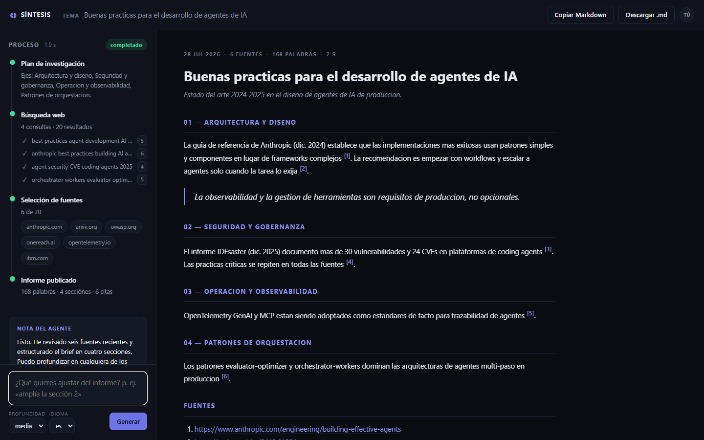

# Synthesis — AI Report Generation Agent

A local FastAPI + LangChain web app that turns a single topic into a cited, structured research brief. A ReAct agent plans its own research, searches the web with Tavily, and publishes the report live while you watch — no chat back-and-forth required, though you can always ask it to refine what it wrote.



## How it works

1. You type a topic and hit **Generate**.
2. The agent (OpenRouter, tool-calling ReAct loop) decides what to search for, runs a handful of Tavily queries, and drafts the report.
3. Every step streams to the browser over Server-Sent Events as it happens — searches, sources, and the final brief — building the **Process** timeline on the left in real time.
4. The finished report renders on the right: numbered sections, inline citations, and a **Fuentes** list with the URLs actually used.
5. Ask for a refinement ("expand section 2", "add 2025 data") and the agent rewrites the whole report; the app keeps a session-local history you can page through.

## Features

- **Live process timeline** — research plan, search queries with result counts, source selection (with domain chips), and publish stats (words / sections / citations), all derived from the agent's real tool calls, not simulated.
- **Streamed generation** — tokens, tool steps, and the final report arrive over SSE as the agent produces them.
- **Depth and language controls** — steer the brief's detail level without leaving the composer.
- **One-click export** — copy the raw Markdown or download it as `.md`.
- **Session history** — page back through every report generated in the current browser tab.
- **Sanitised rendering** — all agent-authored Markdown is converted server-side and scrubbed with `bleach` before it ever reaches the DOM.

## Requirements

- **Python 3.11+** — required for the type syntax and async features used throughout.
- **An OpenRouter API key** — free at https://openrouter.ai/keys (free tier: 20 req/min, 50 req/day).
- **A Tavily API key** — free at https://app.tavily.com (free tier: 1,000 credits/month).

## Installation

Open PowerShell in the project directory and run:

```powershell
python -m venv .venv
.venv\Scripts\Activate.ps1
pip install -r requirements.txt
Copy-Item .env.example .env
```

Then edit `.env` with your keys:

```env
OPENROUTER_API_KEY=sk-or-v1-xxxxxxxx
TAVILY_API_KEY=tvly-xxxxxxxx
MODEL_ID=nvidia/nemotron-3-ultra-550b-a55b:free
```

## Running it

With the virtual environment active:

```powershell
uvicorn app.server:app --reload --port 8000
```

Then open http://127.0.0.1:8000 in your browser.

## Running it with Docker

An alternative to the venv — no local Python required. Create `.env` from `.env.example` first (the keys stay on the host; they are never baked into the image), then:

```powershell
docker compose up --build
```

Open http://localhost:8000. Stop it with `docker compose down`, follow the logs with `docker compose logs -f`.

The container runs a single uvicorn worker, because sessions live in a per-process dictionary — see *Known limitations*. The listening port honours `$PORT` if set, so the same image runs unchanged on a PaaS that assigns one.

## Quota limits

| Provider | Free tier | Practical impact |
|---|---|---|
| OpenRouter | 20 requests/min · 50 requests/day | The agent caps itself at `max_iterations=6` per turn, so a full report costs roughly 6 requests — about 8 complete reports per day. |
| Tavily | 1,000 credits/month | Each search the agent runs consumes one credit. |

## Usage

1. Type a topic or question in the composer (e.g. *"latest advances in AI agent orchestration"*).
2. Watch the process timeline populate as the agent searches and drafts the report.
3. Refine the result with follow-up messages, or use the quick-action suggestions under the agent's note:
   - *"Expand section 2"*
   - *"Add 2025 data"*
   - *"Explain concept X"*
4. Copy the Markdown or download the finished report with the buttons in the top bar.

## Tests

**Offline tests (default, no network calls):**
```powershell
pytest
```

**Live tests against the real APIs (spends quota):**
```powershell
pytest -m live
```

50 offline tests cover configuration, session isolation, error classification, rendering, tools, the agent, and the SSE server. One opt-in live test validates the full integration with OpenRouter and Tavily.

## Known limitations

- **No persistence** — restarting the server discards every session; everything lives in memory by design.
- **No authentication** — there is no access control. Anyone who can reach the local port can read any session's report via `GET /api/report/{session_id}` if they guess or observe the `session_id`. Each browser tab does get its own isolated session (`session_id` lives in `sessionStorage`, per tab), but this is not suitable for a multi-tenant environment without mutual trust between users.
- **No PDF export** — download is Markdown-only.
- **`AgentExecutor` is in maintenance mode** — LangChain deprecated it as of v1.0, which is why `requirements.txt` pins `langchain<1.0`.
